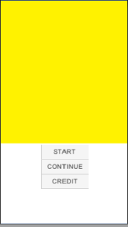
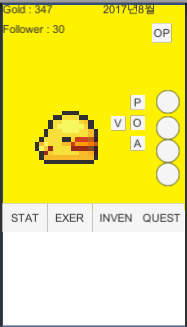

# Unity exam

<<<<<<< HEAD
## musculusGame001
	-2017.06.15
	-2017.08.30
=======
## ForeverSeries001
	-2017.05
	gold,second per gold, click per gold
	a, b, c stren
	x, y, z ability
	realtime and time bar for month

>>>>>>> 99b62f288b3fa006fbe5caebb0f9bf139eb37ff0
	

## ClickerGame002
	-2017.05.15
	title and main layout
	main basic UI
	real time system
	======================
	resolution problem!!!

## ClickerGame003
	-2017.05.16
	ClickerGame002's solve resolution problem
	schedule system
	player click system
	-2015.05.17
	Clicker method
	if adding month and stop timespan, disable click.
	skill's value selected schedule is added per 10 clicks.

## Unityproject001
	-puzzle game

## ColorDS002
	-color memoey game